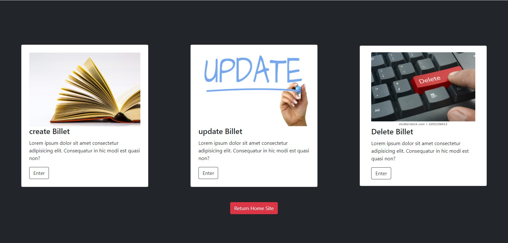
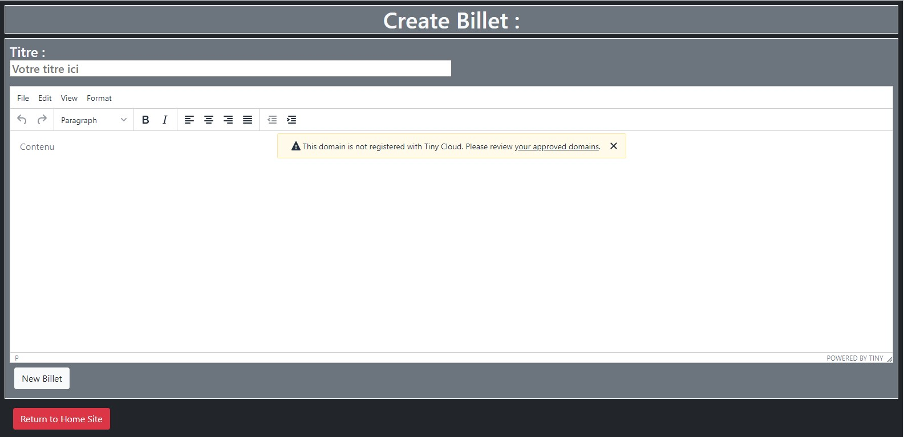
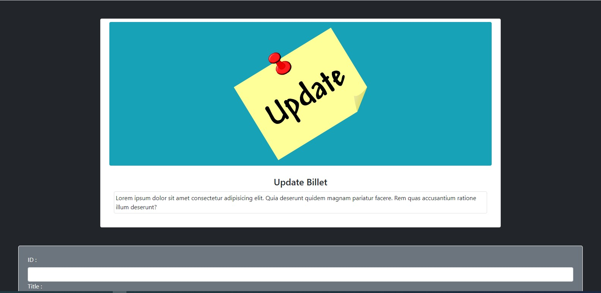
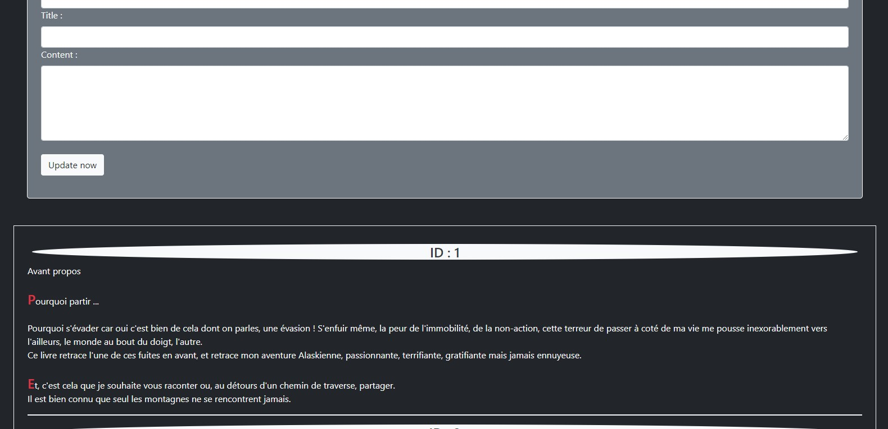

I present to you my fortieth project of my conversion to the profession of web developer, it's a php/mySQL project.
I've already realized a Javascript Project and of course i use also HTML/CSS, SASS, NPM, etc ...
I also started learning Vue.js as well as Angular for the front-end frameworks and Symfony for the Back-end.

this profession is really facinating and more i learn, more i like it, and it's just the begin ...

Here are some photos of the admin part otherwise the site is accessible with this link : [Blog Jean Forteroche](http://jeanforteroche.devwebdino.com/?action=accueil)

Please note: the site is in French !

Sorry, for my english i'm French so i can't do better ... or maybe that if ;-)

 
 
 

So right now, i love it php and Symfony

